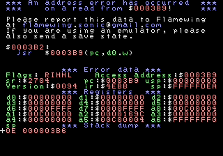
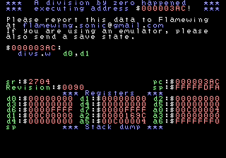
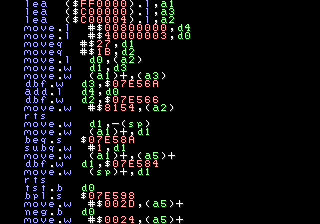

## License
This uses a bsd 0-Clause License (0BSD). The TL;DR version is [here](https://tldrlegal.com/license/bsd-0-clause-license).

Basically, you can use however you want, and you don't have to add credits, licenses, or anything to your hack.

I only ask for the courtesy of giving some credit if you use it, but you are not forced to do it.

## About
This is a general error debugging screen for the Sega Genesis witht he following features:

- integrated disassembler, which is logically separated from the drawing code and from the debugger screen;
- the code almost fully position-independent, meaning a binary blob can be made;
- recovers more information from branches and many jumps, including dbCC opcodes;
- brand new font with ASCII encoding, so you can roll your own;
- handles all errors that can happen on a 68k, even if they cannot happen on a real Sega Genesis (such as bus errors);
- has code that will make macro haters want to stay away.

Note: If you use asm68k, you will not be able to build this. I use macros and functions to make the code more maintainable and readable, and asm68k sucks. Badly. And I am not saying this only in regards to macros -- I used to think it was only slightly worse than AS, but now I stand corrected: while I was working on a binary blob to support asm68k, I ran into a serious bug in it that caused it to misassemble the code generating wrong output. It suffices to say that instead of helping, I will mercilessly mock anyone that insists on using asm68k because of their bad decision-making skills.

There is another warning I must give: I won't give support for anything but the Sonic Git disassemblies, so if you insist on using outdated disassemblies, you are on your own.

With those out of the way: first, let me explain how you will go about generating a listing file. In the previous version, I talked about map files; listing files are much better because they are generated much faster; the S2 and S&K disassemblies disable it by default, though. In S2, you have to edit 3 places: one in s2.macrosetup.asm and the rest in s2.asm; so:
in s2.macrosetup.asm: find this:
```
        listing off
```

and change it to this:
```
        listing purecode
```

You can also use "on" or "noskipped" instead of "purecode", but I recommend using the latter. So now over to s2.asm, do the same twice. Now whenever you build your hack, a s2.lst file will also be generated.

For S&K, you have to do the same once in sonic3k.macrosetup.asm, then in sonic3k.asm find this:
```
Z80_Snd_Driver: include "Sound/Z80 Sound Driver.asm"
```

and change it to this:
```
Z80_Snd_Driver: include "Sound/Z80 Sound Driver.asm"
        listing purecode
```

Now that you are armed with listing files, time to hook up the new debugger! So go on ahead and grab it here. There are seven files in this archive; only 6 are needed for S2, the seventh is for compatibility with the S&K disassembly. Extract these to your hack's main folder. You can move these around, as long as you edit the includes in the relevant files. You want to add these includes:
For S2:
```
        include "_inc/Debugger.asm"
```

For S&K:
```
        include "skcompat.asm"
        include "Debugger.asm"
```

These are enough to get everything working; he other files are pulled in automatically. Now the debugger is being assembled inside your hack; you want to setup the interrupt vector table to make use of it:

In S2: find ";Vectors:" and replace the whole table with this:
```
;Vectors:
        dc.l System_Stack       , EntryPoint    , BusError              , AddressError   ; 4
        dc.l IllegalInstrError , ZeroDivideError, CHKExceptionError, TRAPVError         ; 8
        dc.l PrivilegeViolation, TraceError     , LineAEmulation   , LineFEmulation ; 12
        dc.l ErrorTrap          , ErrorTrap     , ErrorTrap     , ErrorTrap     ; 16
        dc.l ErrorTrap          , ErrorTrap     , ErrorTrap     , ErrorTrap     ; 20
        dc.l ErrorTrap          , ErrorTrap     , ErrorTrap     , ErrorTrap     ; 24
        dc.l SpuriousException , ErrorTrap      , ErrorTrap     , ErrorTrap     ; 28
        dc.l H_Int                      , ErrorTrap     , V_Int         , ErrorTrap     ; 32
        dc.l TrapVector         , TrapVector    , TrapVector    , TrapVector    ; 36
        dc.l TrapVector         , TrapVector    , TrapVector    , TrapVector    ; 40
        dc.l TrapVector         , TrapVector    , TrapVector    , TrapVector    ; 44
        dc.l TrapVector         , TrapVector    , TrapVector    , TrapVector    ; 48
        dc.l ErrorTrap          , ErrorTrap     , ErrorTrap     , ErrorTrap     ; 52
        dc.l ErrorTrap          , ErrorTrap     , ErrorTrap     , ErrorTrap     ; 56
        dc.l ErrorTrap          , ErrorTrap     , ErrorTrap     , ErrorTrap     ; 60
        dc.l ErrorTrap          , ErrorTrap     , ErrorTrap     , ErrorTrap     ; 64
```

In S&K: find "Vectors:" and replace the whole table with this:
```
Vectors:
        dc.l Vectors            , EntryPoint    , BusError              , AddressError   ; 4
        dc.l IllegalInstrError , ZeroDivideError, CHKExceptionError, TRAPVError         ; 8
        dc.l PrivilegeViolation, TraceError     , LineAEmulation   , LineFEmulation ; 12
        dc.l ErrorTrap          , ErrorTrap     , ErrorTrap     , ErrorTrap     ; 16
        dc.l ErrorTrap          , ErrorTrap     , ErrorTrap     , ErrorTrap     ; 20
        dc.l ErrorTrap          , ErrorTrap     , ErrorTrap     , ErrorTrap     ; 24
        dc.l SpuriousException , ErrorTrap      , ErrorTrap     , ErrorTrap     ; 28
        dc.l H_int_jump         , ErrorTrap     , V_int_jump    , ErrorTrap     ; 32
        dc.l TrapVector         , TrapVector    , TrapVector    , TrapVector    ; 36
        dc.l TrapVector         , TrapVector    , TrapVector    , TrapVector    ; 40
        dc.l TrapVector         , TrapVector    , TrapVector    , TrapVector    ; 44
        dc.l TrapVector         , TrapVector    , TrapVector    , TrapVector    ; 48
        dc.l ErrorTrap          , ErrorTrap     , ErrorTrap     , ErrorTrap     ; 52
        dc.l ErrorTrap          , ErrorTrap     , ErrorTrap     , ErrorTrap     ; 56
        dc.l ErrorTrap          , ErrorTrap     , ErrorTrap     , ErrorTrap     ; 60
        dc.l ErrorTrap          , ErrorTrap     , ErrorTrap     , ErrorTrap     ; 64
```

If you try to assemble and you get errors, it is because you are using an older version of AS; get the new version and replace the ones you have. The Git repositories for the Community disassemblies already have this version, by the way.

Now you just need to trigger an error to see it in action; but if you do that, you will notice that your name and e-mail are wrong; so open "Debugger.asm" and find the following lines:
```
HackerName:     vtstring WHITE,"Your name"
EMailmsg:       vtstring BLUE ,"your.email@server.domain"
```

Except that the e-mail will not be in yellow and underlined, that is just the forum software being an ass. Anyway, supported colors are WHITE, RED, GREEN and BLUE; you can edit the text at will, but your name should not exceed 11 characters -- this is all the space available in the current setup. As the comment near this says, you can use any of the characters int he ASCII set.

Another thing to do is edit the value of the "Revision" constant in the same file -- this number can be used to uniquely identify the version in which the error happened, so you will know if you already fixed the error or not.

When all is said and done, this is what you will see (using two manufactured examples):

 

As a bonus: since the code is logically separate, the disassembler can be used on its own; here is an example of a minimal disassembler that can be build using it:



This was done with this code:
```
DisassemblyTest:
        bsr.w   InitTerminal
        lea     DrawTerminal(pc),a3
        tellp.l -(sp)                                           ; Save end of buffer
        setcursor       DisassemblyAlign,0

.instr_loop:    shared .instr_loop
        move.l  (sp),d0                                         ; Get end of screen buffer
        vtchkp.l        d0                                      ; Is this after current position?
        blo.w   .draw_terminal                                  ; Branch if not
        tellp.l -(sp)                                           ; Save start of line
        move.w  (a3)+,d5                                        ; Read instruction
        lea     RewindStub(pc),a4                               ; Pointer to rts
        bsr.w   Disassemble_Opcode
        movea.l a2,a3                                           ; PC for next instruction
        tellp.l d0                                              ; Save current position on buffer
        seekset (sp)+                                           ; Seek back to old position

.next_line:
        seekp.l nCols                                           ; Advance it by one line
        vtchkp.l        d0                                      ; Is this after current position on buffer?
        bhs.s   .next_line                                      ; Branch if not
        bra.s   .instr_loop
;---------------------------------------------------------------------------------------
.draw_terminal:
        addq.w  #4,sp                                           ; Pop end of screen buffer from stack
        bsr.w   DrawTerminal

.error_trap:
        nop
        nop
        bra.s   .error_trap
; ===========================================================================
```

